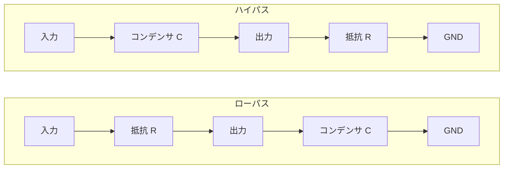

**基礎 · 約10分 · 内容確認 2026-09-19**

## この教材でできるようになること

- 抵抗とコンデンサの位置を変えると、通す変化の速さが変わります。

ローパスとハイパスでは、出力を取り出す部品が異なります。

**式：**

$$
\tau=RC,\qquad f_c=\frac{1}{2\pi RC}
$$

**計算例：** 1 kΩ × 100 nF = 100 µs → fc ≈ 1.59 kHz

## まず直感で：急な変化をゆっくりにする
抵抗を通してコンデンサを充電すると、電圧は瞬時に変わりません。これがRC回路の時間の性質です。RCローパスは速い変化を弱め、ハイパスはゆっくりした変化やDCを弱めます。

## ステップ応答と時定数
初期電圧0 VのCへ、Rを通して一定Vinを加えると $v_C(t)=V_{\mathrm{in}}(1-e^{-t/RC})$。$\tau=RC$を時定数といい、1τで約63.2%、3τで約95%、5τで約99.3%へ達します。放電は $v_C(t)=V_{\mathrm{initial}}e^{-t/RC}$ です。

1 kΩと100 µFならτ = 0.1 s。電解Cの容量許容差や漏れで実測はずれます。スイッチの抵抗や測定器の負荷も現実の回路の一部です。

## ローパス：出力をCの両端から取る
入力→R→出力、出力→C→GND。カットオフ周波数は $f_c=1/(2\pi RC)$。R = 1 kΩ、C = 100 nFなら約1.59 kHzです。正弦波では $|H|=1/\sqrt{1+(f/f_c)^2}$、位相 $=-\arctan(f/f_c)$。fcで振幅約0.707倍、−3.01 dB、位相−45°です。

## ハイパス：出力をRの両端から取る
入力→C→出力、出力→R→GND。fcは同じ式で、$|H|=(f/f_c)/\sqrt{1+(f/f_c)^2}$。DCでは出力0 Vへ落ち着き、高周波では入力へ近づきます。ステップ入力なら一度変化して0 Vへ戻ります。

ハイパス出力を単電源のADCへ入れると負電圧になる場合があります。必要なバイアスと保護を設計し、入門では受動回路単体をオシロで観測します。

## なくす・変えるとどうなるか
ローパスのCを外すと高インピーダンス負荷では入力がほぼそのまま出ます。Rを短絡すると平滑作用が減り、Cへ大きな突入が流れます。RかCを10倍にすると時定数10倍、fcは1/10です。

実際には信号源の出力抵抗や負荷が加わります。FGの50 Ωも無視できるか検討し、Vinをフィルタの入力点で実測してVout/Vinを比べます。

## 理解度チェック

**問い：** RCローパスのCが断線したら、高周波出力はどうなりますか？

答えを見る

高インピーダンス負荷ならコンデンサへ電流が流れなくなり、Rでの電圧降下が減って出力が入力に近づきます。高周波を弱める機能が失われます。

## 知識をつなげる

- [LEVEL 5｜RC回路の充放電を測る](/experiments/lab-05/)
- [LEVEL 8｜FGとオシロでRCフィルタを測る](/experiments/lab-08/)
- [設計 6｜指定カットオフ周波数からRCを設計する](/design/design-06/)
